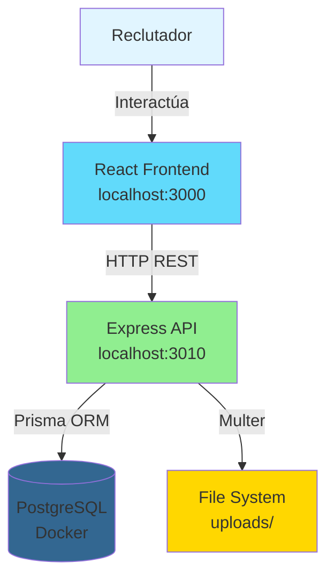
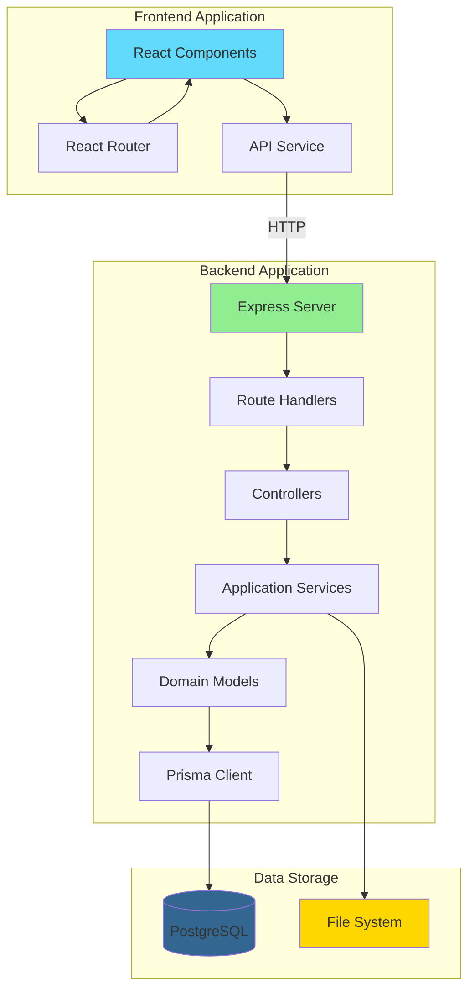
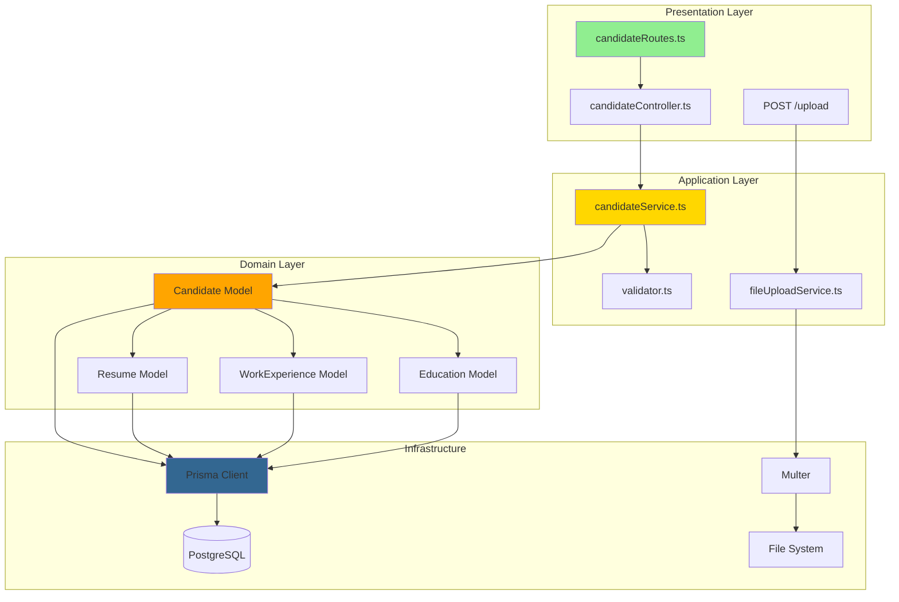
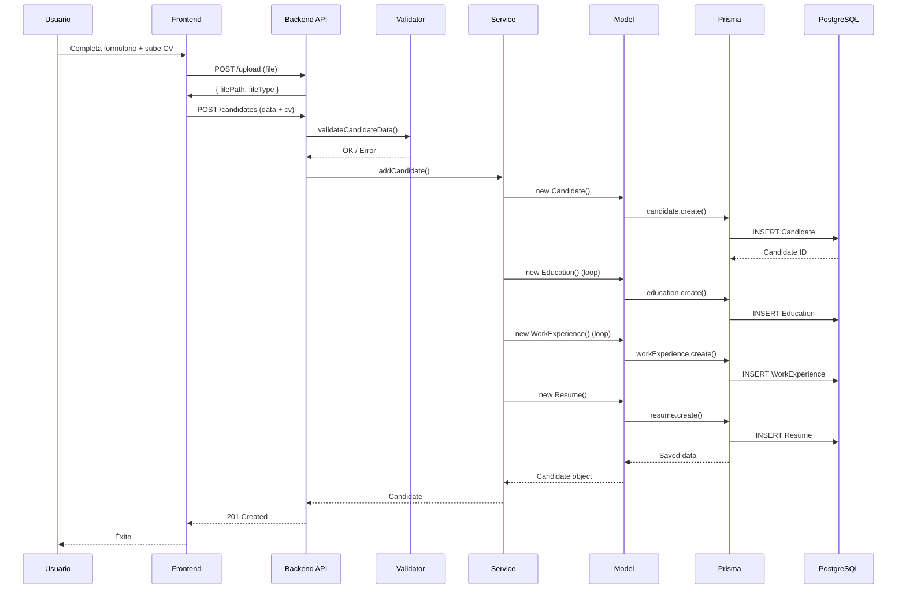
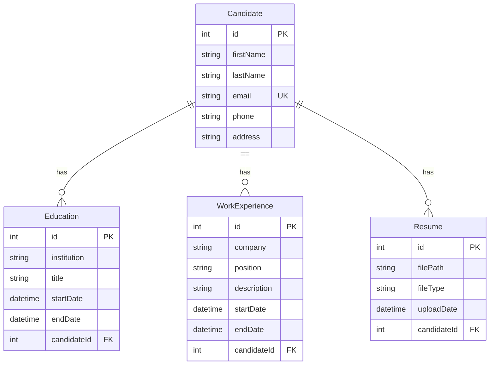
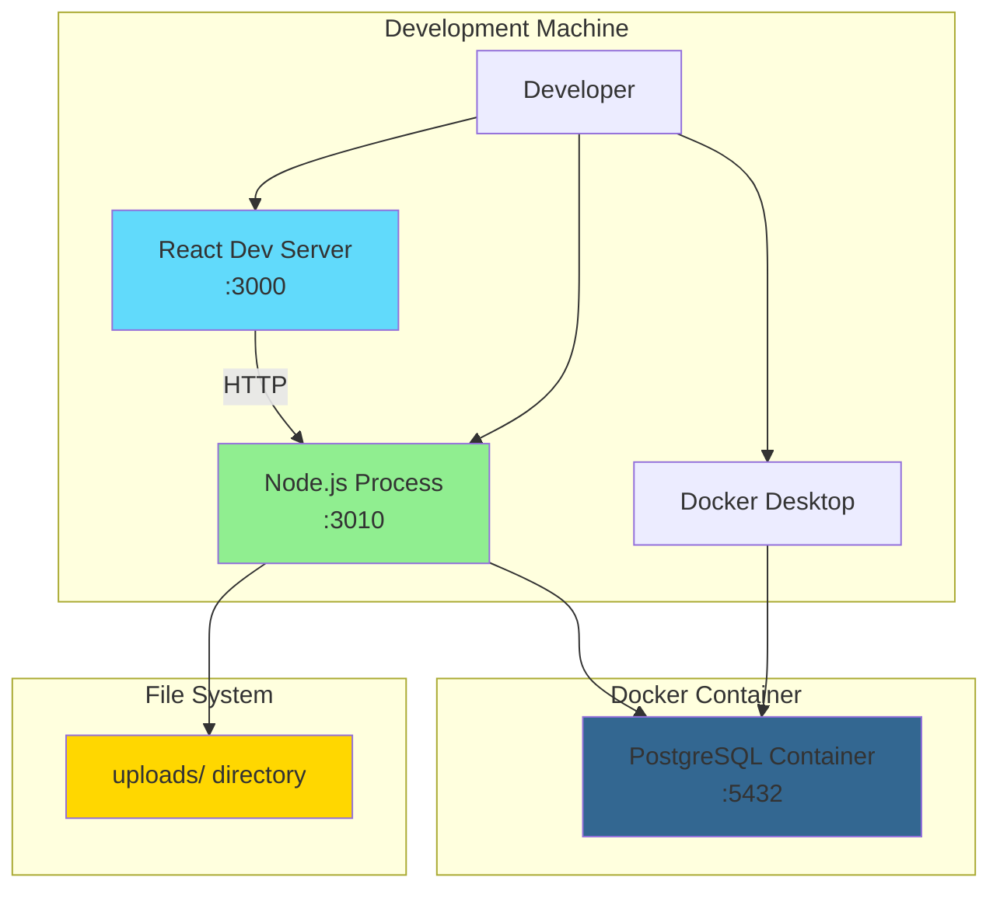

# Architecture Diagrams

## Diagrama C4 - Context Level

## Diagrama C4 - Container Level

## Diagrama de Componentes - Backend

## Diagrama de Flujo - Crear Candidato

## Diagrama de Base de Datos

## Diagrama de Deployment (Actual)

## Notas sobre los diagramas

### Limitaciones

1. **Simplificaciones**:

    - No se muestran todos los middlewares (CORS, logging, error handler)
    - No se muestra la estructura completa de carpetas
    - No se muestran tests

2. **Asunciones**:

    - Frontend y backend en misma máquina (desarrollo)
    - PostgreSQL en Docker local
    - No hay load balancer ni múltiples instancias

3. **Faltantes**:
    - Diagrama de deployment producción (no existe aún)
    - Diagrama de seguridad (autenticación/autorización no implementada)
    - Diagrama de monitoreo (no implementado)

### Actualización

Estos diagramas deben actualizarse cuando:

-   Se añada autenticación
-   Se cambie la arquitectura de deployment
-   Se añadan nuevos componentes significativos
-   Se cambien patrones arquitectónicos
