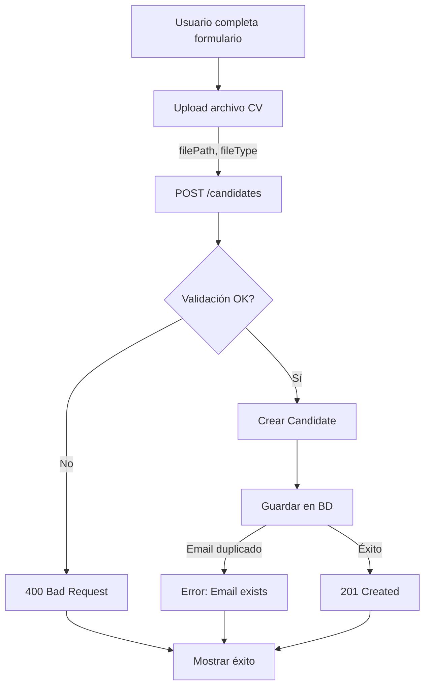

# Key Flows

## Flujo principal: Añadir Candidato

### Descripción

Proceso completo desde que un reclutador completa el formulario hasta que el candidato se guarda en la base de datos.

### Pasos detallados

1. **Usuario completa formulario** (Frontend)

    - Componente: `AddCandidateForm.js`
    - Usuario ingresa:
        - Datos personales (nombre, apellido, email, teléfono, dirección)
        - Educación (múltiples registros)
        - Experiencia laboral (múltiples registros)
    - Usuario selecciona archivo CV

2. **Upload de archivo** (Frontend → Backend)

    - Componente: `FileUploader.js`
    - Endpoint: `POST /upload`
    - Servicio: `fileUploadService.ts`
    - Validaciones:
        - Tipo: PDF o DOCX
        - Tamaño: máximo 10MB
    - Almacenamiento: `../uploads/{timestamp}-{filename}`
    - Respuesta: `{ filePath: string, fileType: string }`

3. **Envío de datos completos** (Frontend → Backend)

    - Servicio: `candidateService.js` (frontend)
    - Endpoint: `POST /candidates`
    - Payload incluye:
        - Datos personales
        - Array de educaciones
        - Array de experiencias
        - Objeto CV con `filePath` y `fileType`

4. **Validación de datos** (Backend)

    - Ubicación: `backend/src/application/validator.ts`
    - Validaciones:
        - Nombres: regex, longitud 2-100
        - Email: formato válido
        - Teléfono: formato español o vacío
        - Dirección: máximo 100 caracteres
        - Educación: institución, título, fechas
        - Experiencia: empresa, puesto, fechas
        - CV: objeto válido con filePath y fileType
    - Si falla: Error 400 con mensaje

5. **Creación de modelo de dominio** (Backend)

    - Servicio: `candidateService.ts`
    - Crea instancia: `new Candidate(candidateData)`

6. **Persistencia en cascada** (Backend)

    - Modelo: `Candidate.save()`
    - Prisma crea:
        1. Registro en tabla `Candidate`
        2. Registros en tabla `Education` (si hay)
        3. Registros en tabla `WorkExperience` (si hay)
        4. Registro en tabla `Resume` (si hay)
    - Todo en una transacción implícita de Prisma

7. **Manejo de errores** (Backend)

    - Email duplicado: Error "The email already exists"
    - Error de conexión BD: Error "No se pudo conectar con la base de datos"
    - Otros errores: Se propagan

8. **Respuesta** (Backend → Frontend)

    - Código: 201 Created
    - Body: Candidato creado con ID y relaciones

9. **Feedback al usuario** (Frontend)
    - Muestra mensaje de éxito
    - **UNKNOWN**: No se detecta código de manejo de errores en frontend

### Archivos involucrados

**Frontend**:

-   `frontend/src/components/AddCandidateForm.js`
-   `frontend/src/components/FileUploader.js`
-   `frontend/src/services/candidateService.js`

**Backend**:

-   `backend/src/routes/candidateRoutes.ts`
-   `backend/src/presentation/controllers/candidateController.ts`
-   `backend/src/application/services/candidateService.ts`
-   `backend/src/application/validator.ts`
-   `backend/src/domain/models/Candidate.ts`
-   `backend/src/application/services/fileUploadService.ts`

### Puntos de fallo

1. **Archivo inválido**: Tipo no permitido o tamaño excedido
2. **Validación fallida**: Datos no cumplen reglas
3. **Email duplicado**: Ya existe candidato con ese email
4. **Error de BD**: Conexión fallida o error de Prisma
5. **Error de filesystem**: No se puede escribir archivo

## Flujo secundario: Consultar Candidato por ID

### Descripción

Obtener información completa de un candidato existente.

### Pasos

1. **Request** (Frontend o API client)

    - Endpoint: `GET /candidates/:id`
    - Parámetro: ID numérico

2. **Validación de ID** (Backend)

    - Controlador: `candidateController.ts`
    - Verifica que ID sea numérico
    - Si no: Error 400

3. **Búsqueda en BD** (Backend)

    - Servicio: `getCandidateById(id)`
    - Modelo: `Candidate.findOne(id)`
    - Prisma: `candidate.findUnique({ where: { id } })`

4. **Respuesta** (Backend)
    - Si existe: 200 OK con datos del candidato
    - Si no existe: 404 Not Found

### Archivos involucrados

-   `backend/src/routes/candidateRoutes.ts` (no expuesto actualmente)
-   `backend/src/presentation/controllers/candidateController.ts`
-   `backend/src/application/services/candidateService.ts`
-   `backend/src/domain/models/Candidate.ts`

### Nota

Este endpoint existe pero **no está expuesto en las rutas actuales**. Solo `POST /candidates` está activo.

## Flujo no implementado: Listar Candidatos

### Descripción

Obtener lista de todos los candidatos (con paginación idealmente).

### Estado

**NO IMPLEMENTADO**

### Qué se necesitaría

1. Endpoint: `GET /candidates`
2. Servicio: `getAllCandidates(limit?, offset?)`
3. Modelo: Método estático `Candidate.findAll()`
4. Prisma: `candidate.findMany()`

### Archivos a modificar

-   `backend/src/routes/candidateRoutes.ts`: Añadir ruta GET
-   `backend/src/application/services/candidateService.ts`: Añadir función
-   `backend/src/domain/models/Candidate.ts`: Añadir método estático
-   `backend/src/presentation/controllers/candidateController.ts`: Añadir controlador

## Flujo no implementado: Editar Candidato

### Descripción

Actualizar información de un candidato existente.

### Estado

**PARCIALMENTE IMPLEMENTADO**

El modelo `Candidate` tiene lógica de update en `save()` (si tiene `id`), pero:

-   No hay endpoint HTTP
-   No hay controlador
-   No hay ruta

### Qué se necesitaría

1. Endpoint: `PUT /candidates/:id` o `PATCH /candidates/:id`
2. Validación: Similar a creación pero campos opcionales si es PATCH
3. Servicio: `updateCandidate(id, data)`
4. Modelo: Ya tiene lógica en `save()` cuando `id` existe

### Archivos a modificar

-   `backend/src/routes/candidateRoutes.ts`: Añadir ruta PUT/PATCH
-   `backend/src/presentation/controllers/candidateController.ts`: Añadir controlador
-   `backend/src/application/services/candidateService.ts`: Añadir función (opcional, puede usar `save()` directamente)

## Flujo no implementado: Eliminar Candidato

### Descripción

Eliminar un candidato y sus relaciones.

### Estado

**NO IMPLEMENTADO**

### Qué se necesitaría

1. Endpoint: `DELETE /candidates/:id`
2. Servicio: `deleteCandidate(id)`
3. Prisma: `candidate.delete()` (cascada automática si está configurada)
4. **Consideración**: ¿Eliminar también archivos CV del filesystem?

### Archivos a crear/modificar

-   `backend/src/routes/candidateRoutes.ts`: Añadir ruta DELETE
-   `backend/src/presentation/controllers/candidateController.ts`: Añadir controlador
-   `backend/src/application/services/candidateService.ts`: Añadir función

## Flujo no implementado: Descargar CV

### Descripción

Obtener archivo CV de un candidato.

### Estado

**NO IMPLEMENTADO**

### Qué se necesitaría

1. Endpoint: `GET /candidates/:id/resume/:resumeId` o `GET /resumes/:id`
2. Servicio: Leer archivo del filesystem
3. Respuesta: Stream del archivo con headers apropiados
4. Validación: Verificar que el CV pertenece al candidato

### Archivos a crear/modificar

-   `backend/src/routes/candidateRoutes.ts`: Añadir ruta
-   `backend/src/presentation/controllers/candidateController.ts`: Añadir controlador
-   `backend/src/application/services/candidateService.ts`: Añadir función de lectura de archivo

## Diagrama de flujo simplificado

