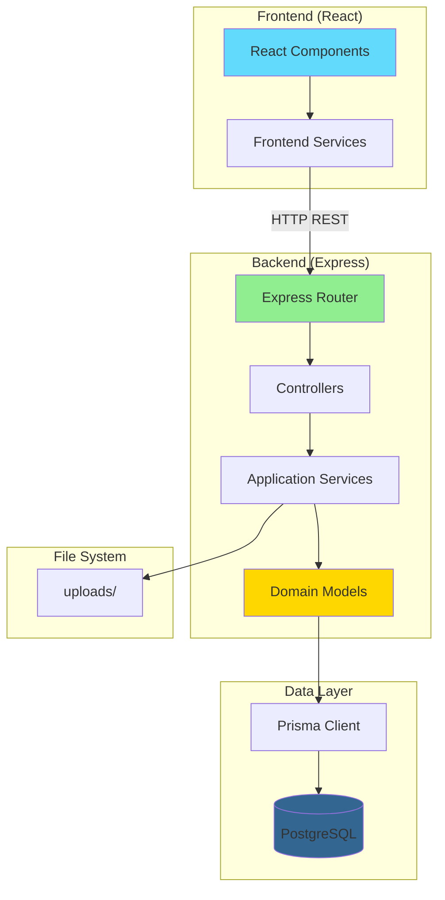

# System Patterns

## Arquitectura

**Tipo**: Aplicación full-stack monolítica con separación frontend/backend

-   **Frontend**: React SPA (Single Page Application)
-   **Backend**: Express API REST
-   **Base de datos**: PostgreSQL (Docker)
-   **ORM**: Prisma

**No es**:

-   Microservicios (todo el backend es un solo servicio)
-   Monorepo con packages compartidos (frontend y backend son independientes)
-   Serverless (aplicación tradicional con servidor persistente)

## Patrones repetidos en el código

### 1. Arquitectura en Capas (Backend)

```
presentation/ (controllers)
    ↓
application/ (services)
    ↓
domain/ (models)
    ↓
Prisma Client → PostgreSQL
```

**Ubicación**:

-   `backend/src/presentation/controllers/` - Controladores HTTP
-   `backend/src/application/services/` - Lógica de negocio
-   `backend/src/domain/models/` - Modelos de dominio con métodos de persistencia

### 2. Active Record Pattern (Domain Models)

Los modelos de dominio (`Candidate`, `Education`, `WorkExperience`, `Resume`) tienen métodos de instancia para persistir:

```typescript
const candidate = new Candidate(data);
await candidate.save(); // Guarda en BD
```

**Ubicación**: `backend/src/domain/models/*.ts`

### 3. Service Layer Pattern

Los servicios (`candidateService.ts`) orquestan la lógica de negocio:

-   Validación (`validateCandidateData`)
-   Creación de modelos de dominio
-   Persistencia en cascada (candidato → educación → experiencia → CV)

**Ubicación**: `backend/src/application/services/candidateService.ts`

### 4. Repository Pattern (implícito)

Prisma Client actúa como repositorio, pero los modelos de dominio encapsulan las queries:

```typescript
static async findOne(id: number): Promise<Candidate | null>
```

**Ubicación**: Métodos estáticos en modelos de dominio

### 5. Middleware Pattern (Express)

-   CORS middleware
-   JSON parser
-   Prisma client injection (via `req.prisma`)
-   Error handler global
-   Logging middleware

**Ubicación**: `backend/src/index.ts`

### 6. Component-Based Architecture (Frontend)

React con componentes funcionales:

-   `RecruiterDashboard` - Dashboard principal
-   `AddCandidateForm` - Formulario de candidato
-   `FileUploader` - Componente de upload

**Ubicación**: `frontend/src/components/`

### 7. Service Layer (Frontend)

Servicio para comunicación con API:

-   `candidateService.js` - Llamadas HTTP al backend

**Ubicación**: `frontend/src/services/candidateService.js`

## Convenciones de carpetas y naming

### Backend

```
backend/
  src/
    index.ts                    # Entry point
    application/
      services/                 # Business logic
      validator.ts              # Validation utilities
    domain/
      models/                   # Domain models (Active Record)
    presentation/
      controllers/              # HTTP controllers
    routes/                     # Route definitions
  prisma/
    schema.prisma              # Database schema
    migrations/                # DB migrations
```

**Naming**:

-   Archivos: `camelCase.ts`
-   Clases: `PascalCase` (Candidate, Education)
-   Funciones: `camelCase` (addCandidate, validateEmail)
-   Rutas: `/candidates`, `/upload`

### Frontend

```
frontend/
  src/
    components/                 # React components
    services/                   # API services
    assets/                     # Static assets
  public/                       # Public files
```

**Naming**:

-   Componentes: `PascalCase.js` o `PascalCase.tsx`
-   Servicios: `camelCase.js`
-   Archivos: `camelCase.js` o `PascalCase.tsx`

## Relaciones entre componentes

### Backend Flow

```
HTTP Request
  ↓
Express Router (index.ts)
  ↓
Route Handler (candidateRoutes.ts)
  ↓
Controller (candidateController.ts)
  ↓
Service (candidateService.ts)
  ↓
Domain Model (Candidate.ts)
  ↓
Prisma Client
  ↓
PostgreSQL
```

### Frontend Flow

```
User Interaction
  ↓
React Component (AddCandidateForm.js)
  ↓
Service (candidateService.js)
  ↓
HTTP Request (fetch/axios)
  ↓
Backend API
```

### Dependencias entre módulos

**Backend**:

-   `index.ts` → `routes/candidateRoutes.ts`
-   `index.ts` → `application/services/fileUploadService.ts`
-   `routes/candidateRoutes.ts` → `presentation/controllers/candidateController.ts`
-   `candidateController.ts` → `application/services/candidateService.ts`
-   `candidateService.ts` → `domain/models/*.ts`
-   `domain/models/*.ts` → `@prisma/client`

**Frontend**:

-   `App.tsx` → `components/RecruiterDashboard.js`
-   `RecruiterDashboard.js` → `components/AddCandidateForm.js`
-   `AddCandidateForm.js` → `components/FileUploader.js`
-   `AddCandidateForm.js` → `services/candidateService.js`

## Diagrama de arquitectura



**Limitaciones del diagrama**:

-   No muestra middleware (CORS, logging, error handling)
-   No muestra estructura de carpetas exacta
-   No muestra tests
-   Simplifica el flujo de upload (multer no aparece explícitamente)

## Patrones de validación

### Backend

1. **Validación en capa de aplicación** (`validator.ts`)

    - Funciones puras de validación
    - Regex patterns para formatos
    - Límites de longitud según schema DB

2. **Validación en servicio** (`candidateService.ts`)

    - Llama a `validateCandidateData` antes de crear modelos

3. **Validación en modelo** (implícita)
    - Prisma valida tipos y constraints de BD

### Frontend

-   Validación básica en formularios (UNKNOWN: no se detecta código de validación frontend específico)

## Manejo de errores

### Backend

1. **Try-catch en controladores**

    - Captura errores de servicios
    - Retorna códigos HTTP apropiados (400, 404, 500)

2. **Errores de Prisma**

    - `P2002`: Email duplicado → Error custom
    - `P2025`: Registro no encontrado → Error custom
    - `PrismaClientInitializationError`: Error de conexión → Error custom

3. **Error handler global**
    - Middleware de Express al final de la cadena
    - Logs error y retorna 500

**Ubicación**: `backend/src/index.ts` (error handler), controladores y servicios

## Inyección de dependencias

-   **Prisma Client**: Inyectado en `req.prisma` via middleware
-   **No hay DI container**: Dependencias se importan directamente

**Ubicación**: `backend/src/index.ts` (middleware de Prisma)
