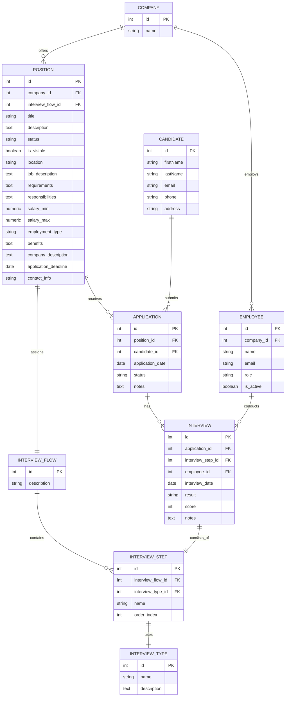

# Prompts Operativos - Sesión de Expansión de Base de Datos

Este documento recopila los principales prompts operativos utilizados durante la sesión de expansión de la base de datos y sus resultados obtenidos.

**Fecha**: 2025-12-16  
**Contexto**: Expansión de base de datos para soportar flujo completo de aplicaciones y entrevistas

---

## 1. Expansión de Base de Datos con Nuevas Entidades

### Prompt

Según el Memory Bank, este proyecto es para realizar ejercicios. Tu misión en este ejercicio es actualizar la base de datos con las nuevas entidades que nos permitan operar el flujo completo de aplicación para diversas posiciones: procede a convertir el ERD en formato mermaid que te proporcionamos, a un script SQL. Analiza la base de datos del código actual y el script SQL y expande la estructura de datos usando las migraciones de Prisma.

Recuerda aplicar buenas practicas, como la definición de Indices y la normalización de la base datos, ya que el ERD proporcionado no cuenta con ello (de ser necesario genera o modifica las .cursor\rules con nuevos estándares para el trabajo con bases de datos).

ERD:



### Resultado

✅ **Completado exitosamente**

**Entregables**:

-   Script SQL generado: `backend/prisma/migrations/erd_to_sql.sql` (196 líneas)
-   Schema Prisma actualizado: `backend/prisma/schema.prisma` con 8 nuevas entidades
-   Reglas de base de datos: `.cursor/rules/database-standards.mdc`
-   Documentación de migración: `backend/prisma/migrations/README_MIGRATION.md`

**Nuevas entidades añadidas**:

1. `Company` - Empresas
2. `Employee` - Empleados
3. `Position` - Posiciones de trabajo
4. `InterviewFlow` - Flujos de entrevista
5. `InterviewStep` - Pasos de entrevista
6. `InterviewType` - Tipos de entrevista
7. `Application` - Aplicaciones
8. `Interview` - Entrevistas

**Buenas prácticas aplicadas**:

-   Timestamps (`createdAt`, `updatedAt`) en todas las tablas
-   Índices en foreign keys y columnas de búsqueda frecuente
-   Índices compuestos para queries comunes
-   Constraints apropiados (`onDelete`, `onUpdate`)
-   Normalización 3NF
-   Check constraint para `Interview.score` (0-100)

**Commits**:

-   `a59ca94` - "feat: expand database schema with interview entities and add database standards"

---

## 2. Reorganización de Reglas de Cursor

### Prompt

```
has creado el documento de .cursorrules, pero en este proyecto estamos utilizando @.cursor/rules/engineering-standards.mdc y @.cursor/rules/memory-bank.mdc . ¿No es mejor práctica mover la nueva @.cursorrules dentro del directorio de .cursor? Analizay actua en consecuencia, modificando o generando los archivos necesarios.
```

### Resultado

✅ **Completado exitosamente**

**Cambios realizados**:

-   Movido `.cursorrules` → `.cursor/rules/database-standards.mdc`
-   Formato actualizado con frontmatter YAML apropiado
-   Configurado `globs` para aplicar a archivos Prisma y SQL
-   Eliminado archivo `.cursorrules` de la raíz

**Estructura final**:

```
.cursor/rules/
  ├── database-standards.mdc    (nuevo)
  ├── engineering-standards.mdc
  └── memory-bank.mdc
```

**Nota**: El commit se incluyó en el commit anterior (`a59ca94`).

---

## 3. Actualización del Memory Bank

### Prompt

```
Si no lo has hecho ya, actualiza los archivos del memory bank con los cambios realizados en este chat
```

### Resultado

✅ **Completado exitosamente**

**Archivos actualizados**:

-   `memory-bank/activeContext.md` - Estado actual y cambios recientes
-   `memory-bank/progress.md` - Cambios recientes y nuevas entidades
-   `memory-bank/techContext.md` - Información sobre Cursor Rules
-   `memory-bank/domains/domain-model.md` - Documentación de nuevas entidades

**Contenido añadido**:

-   Documentación completa de las 8 nuevas entidades
-   Fechas actualizadas a 2025-12-16
-   Información sobre reglas de base de datos
-   Estado de migración pendiente

---

## 4. Corrección de Fechas

### Prompt

```
¿Por qué estás poniendo a los cambios de hoy fecha de 2025-01-27 si estamos a 16 de diciembre de 2025?
```

### Resultado

✅ **Completado exitosamente**

**Correcciones realizadas**:

-   Actualizadas todas las fechas de cambios recientes de `2025-01-27` a `2025-12-16`
-   Mantenidas fechas de confirmaciones anteriores (2025-01-27) que son históricas
-   Archivos corregidos:
    -   `memory-bank/activeContext.md`
    -   `memory-bank/progress.md`
    -   `memory-bank/techContext.md`
    -   `memory-bank/domains/domain-model.md`

---

## 5. Fix: .env.example en .gitignore

### Prompt

```
Verify this issue exists and fix it:

The change uncomments `**/.env` to globally ignore all `.env` files. However, the project design requires a `.env` file in the root directory for `docker-compose.yml` configuration (containing `DB_NAME`, `DB_PORT`, `DB_USER`, `DB_PASSWORD`). This change will cause new developers to not have the required root `.env` file in their cloned repository, breaking the setup instructions documented in `memory-bank/ops/local-dev.md` which explicitly states to create `.env` in the root. The `.env` files should remain untracked, but the documentation and setup need to provide `.env.example` or explicit creation instructions.
```

### Resultado

✅ **Completado exitosamente**

**Problema identificado**:

-   `.gitignore` estaba ignorando `**/.env.example`, impidiendo versionar el archivo de ejemplo

**Solución aplicada**:

-   Eliminada línea `**/.env.example` del `.gitignore`
-   Creado `.env.example` con plantilla de configuración
-   Actualizado `memory-bank/ops/local-dev.md` con instrucciones para copiar `.env.example` a `.env`
-   Añadido comentario explicativo en `.gitignore`

**Archivos creados/modificados**:

-   `.env.example` (nuevo)
-   `.gitignore` (corregido)
-   `memory-bank/ops/local-dev.md` (actualizado)

**Commit**: `484afc1` - "fix: allow .env.example to be versioned and update setup docs"

---

## 6. Fix: Check Constraint y Parsing de .env

### Prompt

```
Verify these issues exist and fix them:

Bug 1: The Prisma schema defines `score Int?` without a check constraint, but the SQL migration file includes `CONSTRAINT "Interview_score_check" CHECK ("score" IS NULL OR ("score" >= 0 AND "score" <= 100))`. The Prisma model is missing this validation constraint...

Bug 2: Line 34 trims the value BEFORE removing quotes: `match[2].trim().replace(/^["']|["']$/g, "")`. This causes incorrect parsing when quoted values have mismatched quotes or unusual spacing...
```

### Resultado

✅ **Completado exitosamente**

**Bug 1 - Check Constraint**:

-   Añadido comentario en schema Prisma documentando el constraint
-   Creado archivo SQL: `backend/prisma/migrations/add_interview_score_check.sql`
-   Actualizado `README_MIGRATION.md` con nota sobre el constraint

**Bug 2 - Parsing de .env**:

-   Corregido orden: remover comillas primero, luego trim
-   De: `match[2].trim().replace(/^["']|["']$/g, "")`
-   A: `match[2].replace(/^["']|["']$/g, "").trim()`
-   Añadido comentario explicativo

**Commit**: `98e6d9f` - "fix: add check constraint documentation and fix env parsing order"

---

## 7. Fix: Inconsistencia applicationDate

### Prompt

```
Verify this issue exists and fix it:

The `applicationDate` field uses `@default(now())` which sets a DateTime value, but is mapped to `@db.Date` which stores only the date portion. The SQL migration correctly uses `CURRENT_DATE` for the DATE column. This inconsistency means Prisma will silently truncate timestamps to midnight, losing time information...
```

### Resultado

✅ **Completado exitosamente**

**Problema identificado**:

-   `@default(now())` genera DateTime completo (con hora)
-   `@db.Date` solo almacena fecha (sin hora)
-   Truncamiento silencioso a medianoche

**Solución aplicada**:

-   Cambiado `@default(now())` a `@default(dbgenerated("CURRENT_DATE"))`
-   Ahora coincide con el SQL migration que usa `CURRENT_DATE`
-   Evita pérdida de información de tiempo

**Cambio**:

```prisma
// Antes:
applicationDate DateTime  @default(now()) @map("application_date") @db.Date

// Después:
applicationDate DateTime  @default(dbgenerated("CURRENT_DATE")) @map("application_date") @db.Date
```

**Commit**: `23c7931` - "fix: use dbgenerated for applicationDate to match DATE column type"

---

## Resumen de Commits Realizados

1. **a59ca94** - "feat: expand database schema with interview entities and add database standards"

    - 8 archivos cambiados, 909 inserciones(+), 20 eliminaciones(-)

2. **484afc1** - "fix: allow .env.example to be versioned and update setup docs"

    - 3 archivos cambiados, 26 inserciones(+), 9 eliminaciones(-)

3. **98e6d9f** - "fix: add check constraint documentation and fix env parsing order"

    - 4 archivos cambiados, 27 inserciones(+), 4 eliminaciones(-)

4. **23c7931** - "fix: use dbgenerated for applicationDate to match DATE column type"
    - 2 archivos cambiados, 3355 inserciones(+), 95 eliminaciones(-)

---

## Lecciones Aprendidas

### Buenas Prácticas Aplicadas

1. **Normalización**: Estructura 3NF sin redundancia
2. **Índices**: En todas las foreign keys y columnas de búsqueda frecuente
3. **Constraints**: `onDelete` y `onUpdate` apropiados para cada relación
4. **Timestamps**: Automáticos en todas las tablas
5. **Documentación**: Comentarios en schema y scripts SQL

### Problemas Encontrados y Resueltos

1. **Check constraints en Prisma**: Prisma no soporta check constraints directamente, se documentan y se añaden via SQL
2. **Tipos de fecha**: `@db.Date` requiere `@default(dbgenerated("CURRENT_DATE"))` no `@default(now())`
3. **Parsing de .env**: Orden correcto: remover comillas antes de trim
4. **Versionado de .env.example**: Los archivos de ejemplo deben estar versionados

### Convenciones del Proyecto

-   **Reglas de Cursor**: Usar formato `.mdc` en `.cursor/rules/` con frontmatter YAML
-   **Fechas**: Usar fecha actual (2025-12-16) para cambios recientes
-   **Commits**: Mensajes descriptivos con prefijo de tipo (feat, fix)
-   **Memory Bank**: Actualizar después de cambios significativos

---

## Estado Final

✅ **Base de datos expandida** con 8 nuevas entidades  
✅ **Buenas prácticas aplicadas** (índices, constraints, normalización)  
✅ **Reglas de base de datos documentadas** en `.cursor/rules/`  
✅ **Bugs corregidos** (check constraint, parsing, applicationDate)  
✅ **Memory Bank actualizado** con todos los cambios  
✅ **Documentación completa** de migración y setup

**Pendiente**: Aplicar migración cuando la base de datos esté disponible:

```bash
cd backend
npx prisma migrate dev --name expand_database_with_interview_entities
```

---

## 8. Aplicación de Migración de Base de Datos

### Prompt

```
npx prisma migrate dev --name expand_database_with_interview_entities
```

### Resultado

✅ **Completado exitosamente tras resolver conflicto de puertos**

**Problema inicial**:

-   Error de conexión: `P1001: Can't reach database server at localhost:5432`
-   Contenedor Docker corriendo pero Prisma no podía conectarse
-   Múltiples procesos escuchando en puerto 5432 (conflicto de puertos)

**Diagnóstico y solución**:

1. **Verificación de contenedor**: Contenedor `ai4devs-db-ro-202510-db-1` estaba corriendo correctamente
2. **Sincronización de .env**: Ejecutado `node scripts/sync-env.js` para asegurar `backend/.env` correcto
3. **Identificación de conflicto**: `netstat` mostró múltiples procesos en puerto 5432
4. **Cambio de puerto**: Actualizado `DB_PORT=5433` en `.env` de la raíz
5. **Reinicio de contenedor**: `docker-compose down && docker-compose up -d`
6. **Re-sincronización**: `node scripts/sync-env.js` con nuevo puerto
7. **Migración exitosa**: Ejecutada sin errores

**Migración aplicada**:

-   **Nombre**: `20251216224021_expand_database_with_interview_entities`
-   **Archivo**: `backend/prisma/migrations/20251216224021_expand_database_with_interview_entities/migration.sql`
-   **Tablas creadas**: Todas las 12 tablas (4 existentes actualizadas + 8 nuevas)
-   **Índices**: Todos los índices y foreign keys configurados correctamente
-   **Prisma Client**: Regenerado automáticamente

**Cambios de configuración**:

-   Puerto de base de datos cambiado de `5432` a `5433`
-   `.env` de la raíz actualizado con `DB_PORT=5433`
-   `backend/.env` sincronizado con `DATABASE_URL` usando puerto 5433

**Commit**: `a68a393` - "feat: aplicar migración de base de datos con entidades de entrevistas"

---

## 9. Actualización del Memory Bank y Commit

### Prompt

```
actualiza memory_bank con fecha de hoy (16 diciembre 2025) y luego haz commit con los cambios
```

### Resultado

✅ **Completado exitosamente**

**Archivos del Memory Bank actualizados**:

-   `memory-bank/activeContext.md`:

    -   Migración marcada como completada
    -   Fecha de última actualización: 2025-12-16
    -   Información sobre cambio de puerto a 5433

-   `memory-bank/progress.md`:

    -   Estado de base de datos actualizado
    -   Migración aplicada documentada
    -   Puerto actualizado a 5433

-   `memory-bank/techContext.md`:
    -   Puerto de PostgreSQL actualizado a 5433
    -   `DATABASE_URL` de ejemplo actualizado con puerto 5433
    -   Nota sobre cambio de puerto el 2025-12-16

**Commit inicial**: `021fd74` - "feat: aplicar migración de base de datos con entidades de entrevistas"

**Archivos incluidos en commit**:

-   Nueva migración: `backend/prisma/migrations/20251216224021_expand_database_with_interview_entities/migration.sql`
-   `backend/prisma/migrations/migration_lock.toml` (actualizado por Prisma)
-   `memory-bank/activeContext.md`
-   `memory-bank/progress.md`

**Nota**: `memory-bank/techContext.md` no se incluyó inicialmente (corregido en siguiente prompt).

---

## 10. Corrección de Commit: Inclusión de techContext.md

### Prompt

```
se te olvidó incluir @memory-bank/techContext.md en el commit
```

### Resultado

✅ **Completado exitosamente**

**Acción realizada**:

-   Añadido `memory-bank/techContext.md` al staging area
-   Commit anterior modificado con `git commit --amend --no-edit`

**Commit corregido**: `a68a393` (antes `021fd74`)

**Archivos finales en commit**:

-   `backend/prisma/migrations/20251216224021_expand_database_with_interview_entities/migration.sql`
-   `backend/prisma/migrations/migration_lock.toml`
-   `memory-bank/activeContext.md`
-   `memory-bank/progress.md`
-   `memory-bank/techContext.md` (añadido)

**Estadísticas del commit**:

-   5 archivos cambiados
-   313 inserciones(+), 18 eliminaciones(-)

---

## Resumen de Commits de Esta Sesión

1. **a68a393** - "feat: aplicar migración de base de datos con entidades de entrevistas"

    - 5 archivos cambiados, 313 inserciones(+), 18 eliminaciones(-)
    - Incluye migración aplicada y actualización completa del Memory Bank

---

## Lecciones Aprendidas de Esta Sesión

### Problemas de Conectividad

1. **Conflicto de puertos**: Múltiples procesos pueden escuchar en el mismo puerto, causando problemas de conexión
2. **Solución**: Cambiar a puerto alternativo (5433 en lugar de 5432)
3. **Sincronización de .env**: Es importante ejecutar `sync-env.js` después de cambios en el `.env` de la raíz

### Buenas Prácticas Aplicadas

1. **Verificación sistemática**: Verificar estado de contenedor, logs, y procesos antes de asumir problemas
2. **Documentación inmediata**: Actualizar Memory Bank inmediatamente después de cambios significativos
3. **Commits completos**: Verificar que todos los archivos relevantes estén incluidos antes de hacer commit
4. **Amend de commits**: Usar `git commit --amend` para corregir commits recientes sin crear commits adicionales

### Convenciones del Proyecto

-   **Puerto de base de datos**: 5433 (cambiado desde 5432 el 2025-12-16)
-   **Memory Bank**: Actualizar siempre después de cambios significativos
-   **Commits**: Incluir todos los archivos relacionados en un solo commit cuando sea posible

---

## Estado Final de Esta Sesión

✅ **Migración aplicada exitosamente** con todas las tablas creadas  
✅ **Conflicto de puertos resuelto** (cambio a puerto 5433)  
✅ **Memory Bank actualizado** con fecha 2025-12-16 y estado actual  
✅ **Commit realizado** con todos los archivos relevantes  
✅ **Base de datos operativa** y lista para uso
